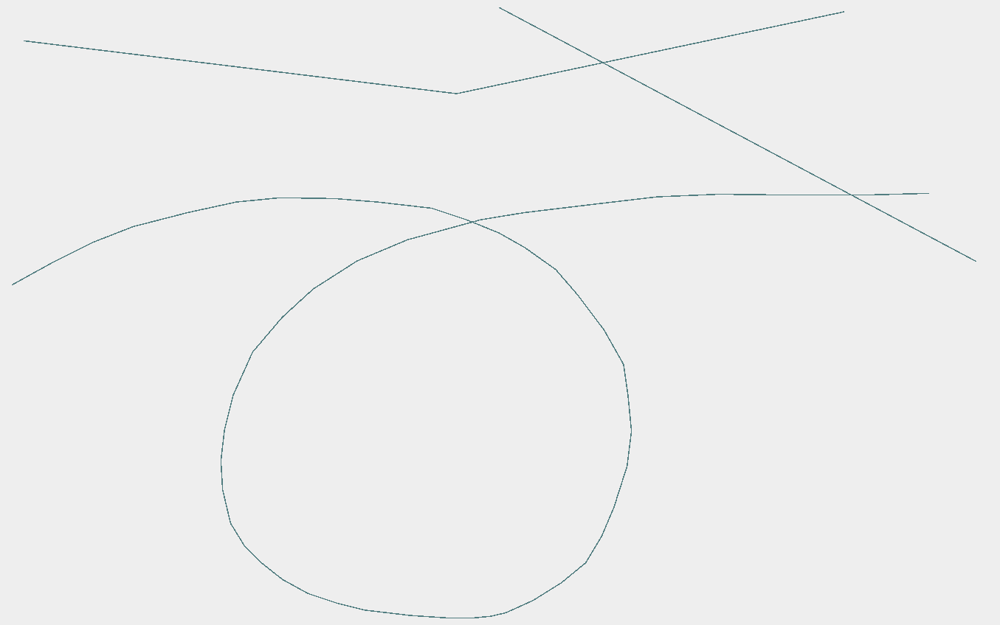

.. _style-expressive:

:Author: Nicolas Mellado
:Version: 0.1
:License: Create Commons with attribution
:Date: 2 Mars 2015 

Styles Interpolation
####################

Style interpolation have been developed during the ANR project `Mapstyle <http://mapstyle.ign.fr/>`_, by Nicolas Mellado. It can be used either using GL an AWT projects.

Introduction
************
Style interpolation has been implemented as SLD extensions, and is based on the new symbolizers ``<PolygonInterpolationSymbolizer>`` and ``<LineInterpolationSymbolizer>``, structured as follow:

 .. code-block:: xml
 
    <LineInterpolationSymbolizer uom="http://www.opengeospatial.org/se/units/metre">
        < *Interpolated style* >
        <FirstSymbolizer uom="http://www.opengeospatial.org/se/units/metre">
            < *First style definition* >
        </FirstSymbolizer>
        <SecondSymbolizer uom="http://www.opengeospatial.org/se/units/metre">
            < *Second style definition* >
        </SecondSymbolizer>
        <alpha>0.5</alpha>
    </LineInterpolationSymbolizer>

The first part of the interpolation symbolizer ``< *Interpolated style* >`` describes the result of the interpolation. There is no need to edit this part, which is **automatically** updated each time any of the input styles is modified. More details are given at the end of this document about the technical aspects of this automatic procedure. 

The ``<FirstSymbolizer>`` and ``<SecondSymbolizer>`` tags define the input symbolizers to be interpolated. Their type is deduced from the main symbolizer type, as ``LineSymbolizer`` for ``LineInterpolationSymbolizer`` and ``PolygonSymbolizer`` for ``PolygonInterpolationSymbolizer``.

The parameter ``alpha`` is defined as :math:`\alpha \in [0:1]` and controls the interpolation between the two symbolizers. 

Symbolizers are interpolated parameter-wise, ie. each parameter is interpolated independently. In the current status only linear interpolation is available, and all the parameters of a symbolizer are interpolated using the same :math:`\alpha` (see section advanced_control_ for advanced control techniques). 

Samples are available in ``geoxygene-appli/samples/interpolation``.

Stroke interpolation
********************
Any the parameter of a classical stroke can be interpolated, except the colormap fields. In the following example (see ``samples/interpolation/SLD/stroke_interpolation.sld.xml``), we interpolate both the color and the thickness of the stroke:

.. literalinclude:: ../../../../geoxygene/geoxygene-appli/samples/interpolation/SLD/stroke_interpolation.sld.xml
    :linenos:
    :language: xml
    :emphasize-lines: 13, 14, 22, 23, 30, 31, 36

Which leads to the following transition:

    
    Interpolating from a thin blueish stroke (:math:`\alpha = 0`) to a thick red stroke (:math:`\alpha = 1`).

Filling interpolation
*********************

Graphic User Interface
**********************

Advanced Control
****************
.. _advanced_control:

However, multiple symbolizers can be used side by side to interpolate between different set of parameters. For instance.

Automatic SLD pairing
*********************

SLD validation and automatic style interpolation
************************************************

