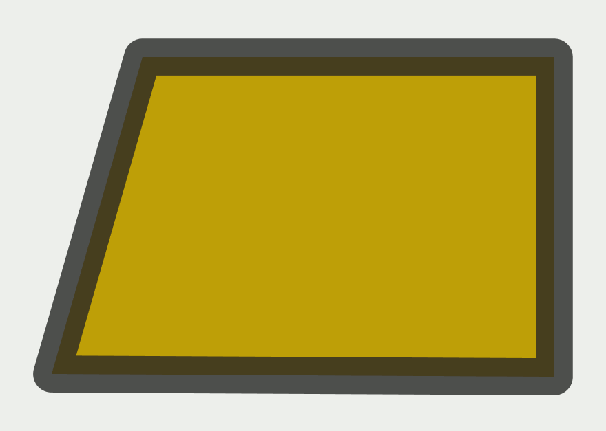
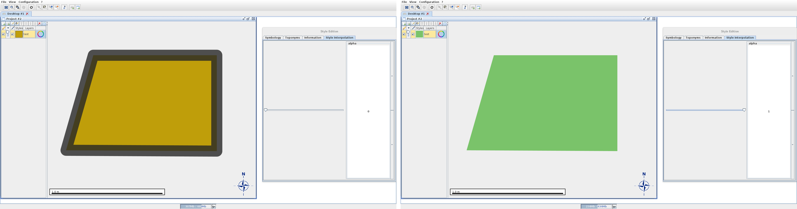
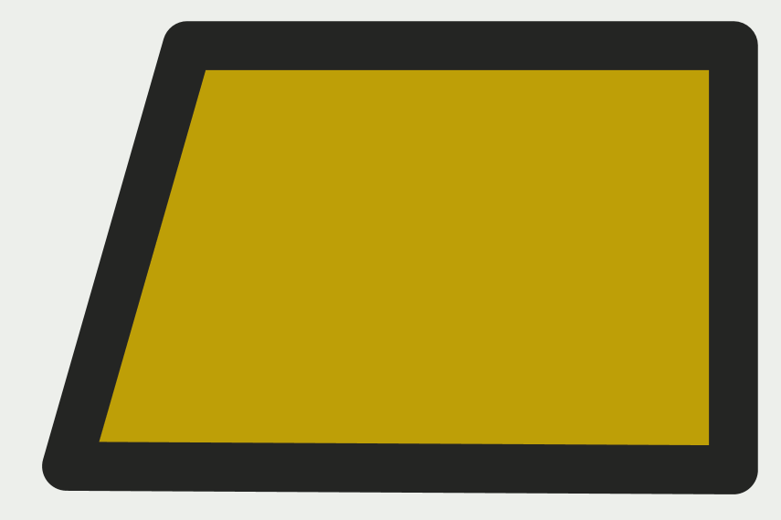
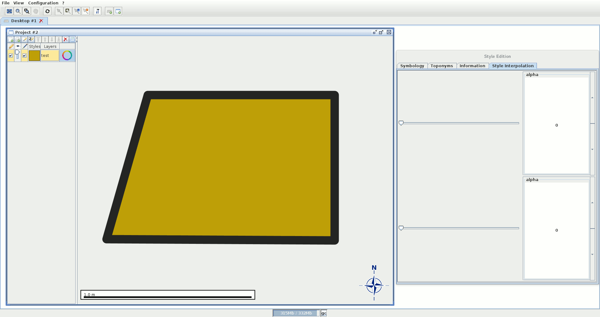

.. _style-expressive:

:Author: Nicolas Mellado
:Version: 0.1
:License: Create Commons with attribution
:Date: 2 Mars 2015 

Styles Interpolation
####################

Style interpolation have been developed during the ANR project `Mapstyle <http://mapstyle.ign.fr/>`_, by Nicolas Mellado. It can be used either using GL an AWT projects.

Introduction
************
Style interpolation has been implemented as SLD extensions, and is based on the new symbolizers ``<PolygonInterpolationSymbolizer>`` and ``<LineInterpolationSymbolizer>``, structured as follow:

 .. code-block:: xml
 
    <LineInterpolationSymbolizer uom="http://www.opengeospatial.org/se/units/metre">
        < *Interpolated style* >
        <FirstSymbolizer uom="http://www.opengeospatial.org/se/units/metre">
            < *First style definition* >
        </FirstSymbolizer>
        <SecondSymbolizer uom="http://www.opengeospatial.org/se/units/metre">
            < *Second style definition* >
        </SecondSymbolizer>
        <alpha>0.5</alpha>
    </LineInterpolationSymbolizer>

The first part of the interpolation symbolizer ``< *Interpolated style* >`` describes the result of the interpolation. There is no need to edit this part, which is **automatically** updated each time any of the input styles is modified. More details are given at the end of this document about the technical aspects of this automatic procedure. 

The ``<FirstSymbolizer>`` and ``<SecondSymbolizer>`` tags define the input symbolizers to be interpolated. Their type is deduced from the main symbolizer type, as ``LineSymbolizer`` for ``LineInterpolationSymbolizer`` and ``PolygonSymbolizer`` for ``PolygonInterpolationSymbolizer``.

The parameter ``alpha`` is defined as :math:`\alpha \in [0:1]` and controls the interpolation between the two symbolizers. 

Symbolizers are interpolated parameter-wise, ie. each parameter is interpolated independently. In the current status only linear interpolation is available, and all the parameters of a symbolizer are interpolated using the same :math:`\alpha` (see section advanced_control_ for advanced control techniques). When an Stroke or a Fill element is defined only for one of the two input symbolizers, its alpha value is interpolated from the defined value to :math:`0`.

Samples are available in ``geoxygene-appli/samples/interpolation``.

Stroke interpolation
********************

.. _stroke_interpolation:

Many parameters of a classical stroke can be interpolated, except the colormap fields. 

Current supported parameter list:

* Color: interpolation in RGB space,
* Opacity,
* Width,
* Cap and Join: use first style value when :math:`\alpha < 0.5`, and second one otherwise
* Expressive Stroke: requires to use the same shader and identical parameter set (different value). Textures can be interpolated if they share the same color space.

Example basic stroke
====================

This example can be reproduced using ``samples/interpolation/SLD/stroke_interpolation.sld.xml``. We interpolate both the color and the thickness of the stroke:

.. literalinclude:: ../../../../geoxygene/geoxygene-appli/samples/interpolation/SLD/stroke_interpolation.sld.xml
    :linenos:
    :language: xml
    :emphasize-lines: 13, 14, 22, 23, 30, 31, 36

Which leads to the following transition:

.. figure:: ../resources/img/styleInterpolation/simple-stroke.gif
    :align: center
    :alt: Transition between two simple strokes
    :figclass: align-center
    :width: 40%
    
    Interpolating from a thin blueish stroke (:math:`\alpha = 0`) to a thick red stroke (:math:`\alpha = 1`). 
    Click to enlarge.

Example expressive stroke
=========================
Coming soon.

Filling interpolation
*********************

Current supported parameter list:

* Color: interpolation in RGB space,
* Opacity,
* Stroke (see section stroke_interpolation_)

Example basic stroke
====================

This example can be reproduced using ``samples/interpolation/SLD/fill_interpolation.sld.xml``. We interpolate both the color and the thickness of the stroke:

.. literalinclude:: ../../../../geoxygene/geoxygene-appli/samples/interpolation/SLD/fill_interpolation.sld.xml
    :linenos:
    :language: xml
    :emphasize-lines: 20, 21, 31, 32, 38, 39

Note that the stoke is not defined in the second style, so the final interpolated style is defined using the first style stroke, with an opacity computed according to :math:`\alpha`.
Which leads to the following transition:

    
    Transition between two polygon styles.
    Click to enlarge.

Graphic User Interface
**********************
Interpolated styles cannot be edited from the style edition frame. Modifying the style from this window will edit only the result of the interpolation, which is recomputed when clicking on the Apply or Ok buttons.

It is however possible to edit the parameter :math:`\alpha` for the selected layer, using the slider(s) located in the *Style Interpolation* tab. Multiple sliders can be used when multiple interpolation symbolizers are used alongside in a single layer (see section advanced_control_)

    
    Using GUI to manipulate interpolation.
    Click to enlarge.

Advanced Control
****************
.. _advanced_control:

Multiple symbolizers can be used side by side to use different alpha for different set of parameters, or define constant parameters.

Partial interpolation example
=============================

The sample ``samples/interpolation/SLD/advanced_partial_interpolation.sld.xml`` is an example of partial interpolation, where the filling properties are interpolated and the stroke style kept uniform using a dedicated PolygonSymbolizer.

.. literalinclude:: ../../../../geoxygene/geoxygene-appli/samples/interpolation/SLD/advanced_partial_interpolation.sld.xml
    :linenos:
    :language: xml
    :emphasize-lines: 10, 31, 32, 40

    
    Use constant stroke properties and interpolates only filling parameters.
    Click to enlarge.

Concurrent interpolation example
================================

.. literalinclude:: ../../../../geoxygene/geoxygene-appli/samples/interpolation/SLD/advanced_split_interpolation.sld.xml
    :linenos:
    :language: xml
    :emphasize-lines: 20, 21, 31, 32, 38, 39

    
    Use different interpolation values for the stroke and filling parameters.
    Click to enlarge.

Automatic SLD pairing
*********************

SLD validation and automatic style interpolation
************************************************

